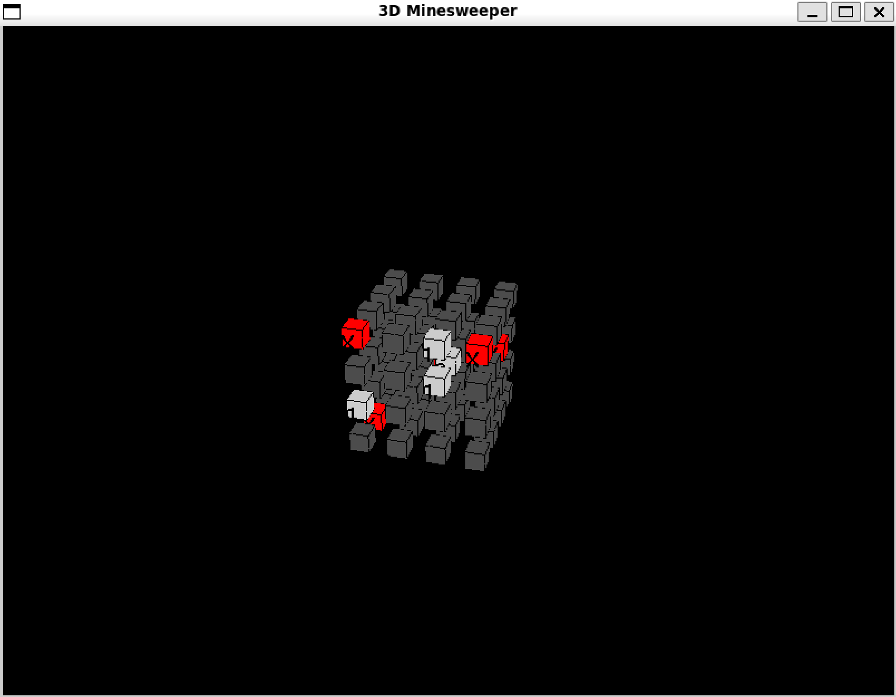

# 3D Minesweeper

A 3D version of the classic Minesweeper game implemented using PyGame and OpenGL. Players can explore a cubic space to find and avoid mines.



In the screenshot:
- Gray cells: Unrevealed cells
- White cells: Revealed safe cells with numbers
- Red cells with 'X': Mines
- Dark gray cells: Remaining unrevealed cells

## Features

- 4x4x4 cubic playing field
- 3D rotation and perspective
- Mouse-based cell selection
- Mine count indicators
- Flag placement system
- Recursive cell revealing
- Full 3D visualization

## Prerequisites

- Python 3.10 or higher
- Required packages (listed in requirements.txt)

## Installation

1. Clone or download the repository:
```bash
git clone [repository-url]
cd 3d-minesweeper
```

2. Create and activate a virtual environment (recommended):
```bash
python -m venv venv
# Windows:
venv\Scripts\activate
# Linux/Mac:
source venv/bin/activate
```

3. Install required packages:
```bash
pip install -r requirements.txt
```

## Running the Game

```bash
python minesweeper.py
```

## Controls

- **Left Click**: Reveal a cell
- **Right Click**: Place/remove a flag
- **Arrow Keys**: Rotate view
  - ↑↓: Rotate up/down
  - ←→: Rotate left/right
- **ESC**: Exit game

## Game Rules

1. The game takes place in a 4x4x4 cube with 5 randomly placed mines
2. When revealing a cell:
   - If it contains a mine: Game Over
   - If it's safe: Shows the number of mines in the 26 surrounding cells
   - If no surrounding mines: Automatically reveals adjacent cells
3. Use flags (right-click) to mark suspected mine locations

## Gameplay Tips

- Use the arrow keys to rotate the cube and get a better view of all cells
- Place flags strategically to keep track of suspected mine locations
- Pay attention to the numbers - they indicate mines in all adjacent cells, including diagonals
- Start with corners or edges as they have fewer adjacent cells

## Technical Details

### Development Environment
- Python 3.10.12
- pygame 2.6.1
- PyOpenGL 3.1.7
- NumPy 1.26.0

### Implementation Features
- Ray casting for accurate cell selection
- OpenGL-based 3D rendering
- Matrix transformations for 3D rotation
- Recursive flood-fill for revealing empty cells

## Known Issues

- Display might lag on some systems when rotating quickly
- Text rendering position might vary slightly depending on the OpenGL environment
- Window focus issues may occur on some operating systems

## Troubleshooting

If you encounter display issues:
1. Try moving or resizing the window
2. Ensure your graphics drivers are up to date
3. Check if OpenGL is properly installed on your system

## Contributing

Feel free to fork the repository and submit pull requests. Please ensure that any modifications maintain the existing code style and include appropriate documentation.

## License

This project is released under the MIT License. See the LICENSE file for details.

## Acknowledgments

- Inspired by the classic Minesweeper game
- Built using PyGame and OpenGL for 3D visualization
- Special thanks to the PyGame and OpenGL communities for their excellent documentation
